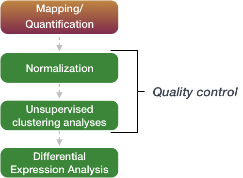

---
layout: page
title: Week  DE Analysis
---

Differential gene expression (DGE) analysis
===========================================

> Overview
> --------
> **Questions**
> 
> *   What are the top DEGs in our experiment? 
>     
> 
> **Objectives**
> 
> *   Use DEGUST to output top differentially expressed genes  
>  
> *   Understand the best diagrams to show differentially expressed genes
> 

---------------------------------------

The next step in the RNA-seq workflow is the differential expression analysis. The goal of differential expression testing is to determine which genes are expressed at different levels between conditions. These genes can offer biological insight into the processes affected by the condition(s) of interest.

The steps outlined in the gray box below we have already discussed, and we will now continue to describe the steps in an **end-to-end gene-level RNA-seq differential expression workflow**.

So what does the count data actually represent? The count data used for differential expression analysis represents the number of sequence reads that originated from a particular gene. The higher the number of counts, the more reads associated with that gene, and the assumption that there was a higher level of expression of that gene in the sample.

**The differential expression analysis steps are shown in the flowchart below in green**. First, the count data needs to be normalized to account for differences in library sizes and RNA composition between samples. Then, we will use the normalized counts to make some plots for QC at the gene and sample level. Finally, the differential expression analysis is performed using your tool of interest.

Using DEGUST
-------------

We will be using the online method  (https://degust.erc.monash.edu/). 

1. Preparing data to be compatable for use in DEGUST
2. Transferring locally
3. Uploading to DEGUST metadata and Kallisto output
4. Understanding the output 

1. Prepare data
------------------

Log onto katana. Change directory into the location that contains your aligned kallisto output `abundance.tsv`.

        $ ssh zID@katana.restech.unsw.edu.au 
        $ cd /srv/scratch/zID/SRR306844chr1_chr3/
        $ ls abundance.tsv
      
This is the file you will transfer to your local computer. 

2. Transferring locally
------------------------

You will now be transferring your file to your local computer. First move into a directory that you can access. 
   
    $ scp zID@katana.restech.unsw.edu.au:"/srv/scratch/zID/output/abundance.tsv" .
    

3. Uploading to DEGUST metadata and Kallisto output
----------------------------------------------------

4. Understanding the output 
----------------------------

Edited from [Training-modules](https://github.com/hbctraining/Training-modules) is maintained by [hbctraining](https://github.com/hbctraining)
