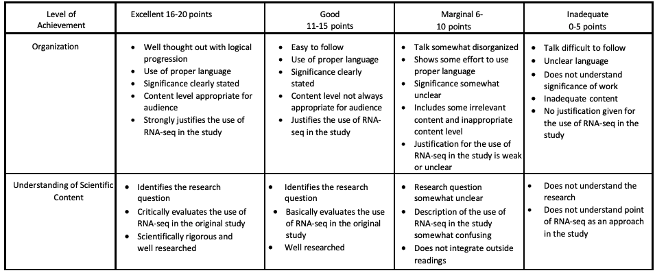
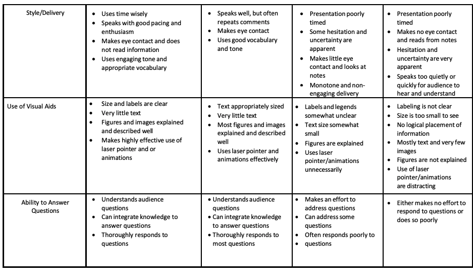

Week 5 - Student Talks 
=====================

Please find use the scoring rubric to inform your form below. 

- Discuss the importance of analysing your dataset to advance research and provide knowledge
- The talks provide some background and rationale to why RNA sequencing analyses is a good approach for this particular study
- You only have 10 minutes so you don’t need to comprehensively cover the source paper-this is not a journal club.
- You don’t have to explain the technical pipeline of RNA-sequencing or the bioinformatic analyses of RNA-seq.
- Provide some background to the disease/disorder.
- Select the most interesting relevant aspects-the major finding and the most important graphs/data that support that finding.
- Your target audience is your Peers.

For every talk you watch please fill out [feedback form](https://docs.google.com/forms/d/e/1FAIpQLSdEPWhRx9LvidLu0TixKHpjtdUic9BF84kfUuMG9EZj9QeMlQ/viewform)

If we overrun timewise, we will use tutorial time. 

